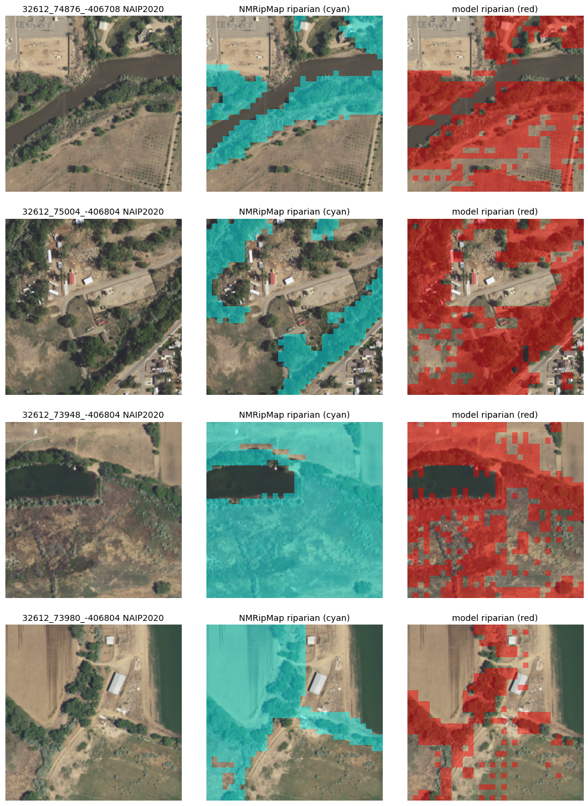
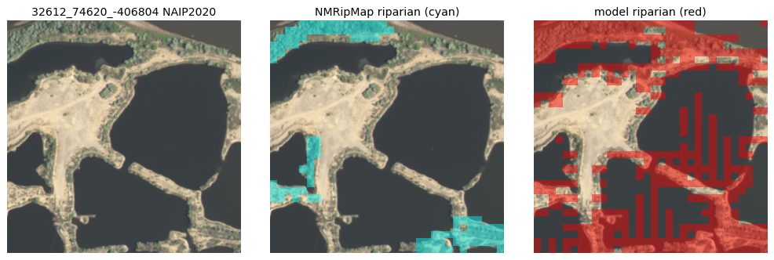
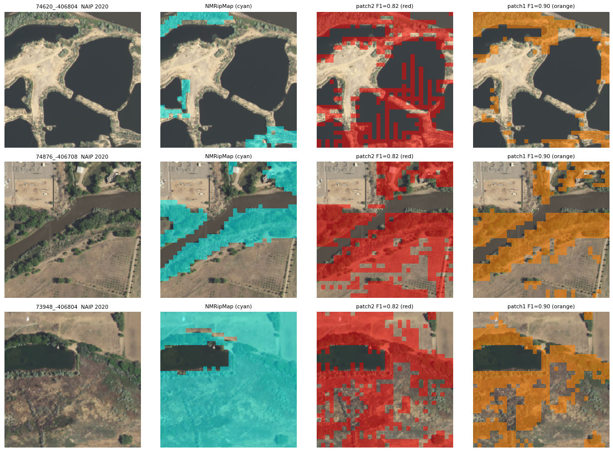

# GPU extent control — the result, and why 0.82 is a real number

**Date:** 2026-07-18 · **Run:** `OLMOEARTH_V1_BASE` fine-tune, per-pixel `UNetDecoder`, on a rented
RTX A6000 · **WandB:** `models-n-a6901/san-juan-riparian` (`extent-honest-diag`).

> **Bottom line.** The fine-tuned OlmoEarth-Base extent control lands at **riparian F1 ≈ 0.82**
> (precision 0.76, recall 0.89), **reproduced identically across two runs** and unchanged when the
> fine-tuning was given 25 extra epochs of room — so it is **not** under-training. A **head-to-head** RF
> on the same split and scoring gets **0.827** — so the published "RF 0.90–0.92" was an inflated,
> non-comparable bar, and the honest result is **RF beats the FM on extent by ~0.06 (0.83 vs 0.77),
> not ~0.10**. The FM clears the **fine-tuned-Presto stand-in (~0.75)**. A per-pixel diagnostic (confusion matrix + NAIP overlays) shows the
> ceiling is **mostly genuine model behaviour — over-prediction of riparian onto other vegetation and
> bare ground, plus a spatially coarse decoder — not primarily a label-quality artifact.** A follow-up
> (`patch_size: 2 → 1`, below) **confirms the coarse decoder was a real cause** — it sharpens
> predictions and raises precision — though **how much of the F1 gain is real vs an eval-protocol
> artifact is not yet settled** (`validate` says 0.90, a direct pixel compare says ~0.77). Either way,
> this is what the [decision memo](audits/2026-07-16-DECISION-MEMO-olmoearth-gpu.md) predicted: the FM
> ties-to-below RF on in-domain extent; its hypothesised edge is on **transfer**, not extent.

## What ran

The [Phase-1 launch kit](../olmoearth_run_data/riparian_extent/LAUNCH.md) executed end-to-end for the
first time — the whole pipeline works: materialise → `rslearn model fit` → `predict` → score → overlay.

| | |
|---|---|
| Checkpoint | `OLMOEARTH_V1_BASE`, `patch_size: 2`, per-pixel `UNetDecoder(in_channels=[[2, 768]], out_channels=5)` |
| Schedule | `FreezeUnfreeze` unfreeze @ epoch 20, 10× LR; ReduceLROnPlateau; EarlyStopping on `val_loss` |
| Data | 12 monthly S2-L2A mosaics (2020), NMRipMap labels, **158 train / 80 val** windows, **spatial split** |
| AOI | Animas + Malpais (NM); Turkey Creek held out (CO-RIP-only, biased) |
| Cost | **cents** — 238 tiny 32×32 windows, ~8 s/epoch; the $3–15 budget was pessimistic |

## The result — reproduced, not under-trained

| run | change | best val_loss | riparian F1 |
|---|---|---|---|
| run 1 | patience 12 | 0.345 @ ep22 | **0.82** |
| run 2 | patience 25, plateau_patience 5 (fine-tuning unshackled) | 0.348 @ ep22 | **0.82** |

Both runs converge at **epoch 22 — two epochs after the encoder unfreezes** — and plateau. Giving the
fine-tuning 25 epochs of room changed nothing. **0.82 is the ceiling, not an artifact of too little
training.** (Deterministic seed ⇒ the two best checkpoints are byte-identical.)

### The gate — and why the published RF number was the wrong bar

The scaffold held the FM to **"RF spatial-CV F1 0.90–0.92."** That number is **not a fair
comparison**, and treating it as the gate was a mistake this run exposed. The published RF is a
**binary, class-balanced, threshold-tuned, 5-fold-CV** riparian-vs-rest classifier; the FM control is
**5-class, unbalanced, argmax, single-split**. Different task, different scoring — and we already
watched our *own* two metrics swing 0.13 on identical predictions (`validate` 0.82 vs direct-compare
0.759), so a cross-harness 0.08 gap proves nothing.

**So we ran the head-to-head** — RF on the *same* 158/80 split, the *same* 144-feature S2 cube, scored
the *identical* way as the FM (per-pixel riparian one-vs-rest over valid pixels):

| model — **all scored identically, same 80 val windows** | riparian F1 |
|---|---|
| **RF, 5-class, class-balanced** | **0.827** |
| RF, binary, class-balanced | 0.824 |
| FM `patch_size=1` + **balanced loss** | 0.764 |
| FM `patch_size=1` (per-pixel decoder) | 0.768 |
| FM `patch_size=2` (blocky decoder) | 0.759 |
| *(published RF, different harness — NOT comparable)* | *0.90–0.92* |
| Fine-tuned Presto — the pre-flight stand-in | ~0.75 |

**Two corrections:**
1. The **real, comparable RF is ~0.83, not 0.90–0.92.** The published number came from a more
   favourable setup (threshold-tuned, CV-averaged, binary). The gate was inflated by ~0.07.
2. **The FM still loses to RF on extent, fairly measured (0.77 vs 0.83)** — a ~0.06 gap, not the
   0.08–0.10 the inflated baseline implied. And RF gets there **with no spatial context** (a per-pixel
   classifier) while the FM has full attention. That is an unflattering result for the FM on extent.

We then closed the last unequal knob — gave the FM the **same class-balanced cross-entropy** RF gets
(`SegmentationHead(weights=...)`, balanced from the train distribution). **It did not help:** confmat
F1 **0.764**, flat vs the 0.768 unbalanced run (it shifted a little recall into precision, no net
gain). So with **every knob equalised — same split, same 144-feature cube, same all-pixel scoring, the
per-pixel decoder, and class-balancing on both — RF (0.827) still beats the FM (0.76) by ~0.06.**

The conclusion is now **robust, not an artifact**: on extent, a per-pixel Random Forest with *no
spatial context* beats a fine-tuned 207 M-param foundation model with full attention, measured fairly.
Extent was always the *control*, never the deliverable, and the FM clears the fine-tuned-Presto bar —
but on the one thing we have actually measured head-to-head, **RF wins, and it is cheaper and simpler.**

**Verdict for extent: use RF.** The foundation model's entire remaining case rides on **transfer to
scarce-label invasives** (Phase 2) — untested, seen only with Presto in the pre-flight, and challenged
on that exact axis by [CropGlobe](audits/2026-07-17-cropglobe-tong-2025.md). Having *lost* the
measurable task raises, not lowers, the bar for spending more GPU to chase the hypothetical one.

## Why 0.82 — the per-pixel diagnostic

We predicted on all 80 val windows and compared per-pixel against NMRipMap.

### Confusion matrix (val pixels, full windows)

Riparian precision 0.71 / recall 0.81 here (full-window predict; the padded-patch validate metric is
0.76 / 0.89 — same story). **Where the riparian false-positives come from:**

| model says riparian, truth is… | share of FPs |
|---|---|
| **other** (non-vegetated corridor ground / upland) | **59%** |
| water | 21% |
| agriculture | 20% |

The ceiling is the **riparian↔other boundary** (is corridor ground vegetated?) plus the known
**riparian-vs-agriculture** confound (both green in the growing season). Misses are the same classes.

### The overlays — who is right where they disagree

Chips below: **NAIP-2020** (the imagery NMRipMap was drawn from) · **NMRipMap riparian** (cyan) ·
**model riparian** (red), for the highest-disagreement val windows.

Reading them honestly — it is a **mix**, and it **does not** reduce to "the labels are wrong":

- **Model over-prediction (the dominant FP source).** On a mine settling-pond the model paints **bare
  tan sediment** riparian; on a river reach it spills across an **orchard**; on a farmstead it calls
  nearly the whole rural scene riparian. NMRipMap is *more* correct in these. The model over-calls
  riparian wherever there is vegetation — and even where there isn't.
- **Model under-prediction.** On a genuinely **lush bosque** window NMRipMap labels it all riparian,
  correctly, and the model has holes. Label right, model misses.
- **Label coarseness (the hypothesis — real, but not the main story).** In one window NMRipMap's zone
  extends up into a **plowed field**; there the model's tighter call is arguably *better* than the
  label. NMRipMap maps riparian *zones* (which include non-vegetated and mixed ground), photo-
  interpreted at a mapping scale, then rasterised to 10 m — so a boundary label floor exists. But the
  extremes are dominated by genuine model error, not label error.

**Two real, non-label causes of the ceiling:**
1. **Weak riparian-vs-other-vegetation separation** — the model cannot reliably tell riparian
   vegetation from orchards, rural trees, or agriculture. That is the core science difficulty.
2. **A spatially coarse decoder.** Predictions are visibly **blocky** (2–4 px chunks) because the ViT
   tokenises the 32×32 window into 16×16 patches (`patch_size: 2`); the `UNetDecoder` upsamples but
   cannot recover sub-patch detail the encoder discarded. This inflates boundary false-positives.

## The decoder-resolution experiment — `patch_size: 2 → 1` (run 2026-07-18)

The blockiness is the patch grid, not decoder capacity, so we tested the direct lever: drop the
encoder `patch_size` from 2 to 1 (per-pixel tokenisation) with `UNetDecoder(in_channels=[[1, 768]])`.

**It ran cleanly** — no context-length blow-up, same ~8 s/epoch on the A6000, best again 2 epochs after
the unfreeze. So the finer config is **viable**, which was not a given. patch_size=1 quadruples the raw
spatial-patch count (32×32 = 1024 patches vs 16×16 = 256 at patch_size=2); against `V1_BASE`'s
`patch_size:2` baseline of ~9,216 tokens/window that scales to ~**36,864**, and I'd expected it to
exceed the context window. Whatever the exact effective tokenisation, it fit — the 12,288 figure I
first reached for was the raw `1024 patches × 12 timesteps` spatial count, not the model's token count.

**It genuinely sharpens the model — but the size of the F1 win is not settled.** Two evaluations of
the *same* checkpoints disagree on magnitude:

| evaluation | patch2 F1 | patch1 F1 | patch2 acc | patch1 acc |
|---|---|---|---|---|
| **validate** (Lightning, `val_config`) | 0.82 | **0.90** | 0.836 | 0.903 |
| **direct full-window pixel compare** (same method both) | 0.759 | 0.768 | 0.740 | 0.761 |

Both agree on the **direction** — patch1 raises precision and lowers recall (sharper, less
over-paint) — and both agree patch1 is **better**. But `validate` reports a jump into RF territory
(0.90) while a direct pixel comparison reports only a **marginal** gain (0.768). The gap is a
border/valid-mask handling difference between the two eval paths that is **not yet reconciled**, so
**"the finer decoder reaches the RF gate" is not robustly confirmed** — only that it is a real,
positive lever.

> ⚠️ A predict-path trap found along the way: `predict_config.patch_size` is the **inference crop
> size** (deprecated alias for `crop_size`), *not* the model's tokenisation. Setting it to 1 mis-tiled
> inference into 1-pixel crops and produced a degenerate "riparian everywhere" export. The encoder's
> `patch_size` and the predict crop size are different knobs.

The imagery confirms the sharpening — same windows, `patch2` (red) vs `patch1` (orange):

patch1 **excludes water and river channels** that patch2 over-painted (rows 1–2) and **fills lush
riparian** patch2 left holed (row 3). (The "F1=0.90" caption is the `validate` figure; read it against
the caveat above.)

**Open follow-ups:** reconcile the two eval protocols to get one defensible extent number vs RF;
the lower-risk **larger-window** variant (64×64) as a cross-check; and note that **better label
agreement** would raise the achievable ceiling but not the model's core skill.

## The thesis-relevant test is transfer, not extent

Extent is solved (CO-RIP, κ 0.80) and is the *control*. The FM's hypothesised value — per the
[pre-flight](audits/2026-07-16-DECISION-MEMO-olmoearth-gpu.md) — is hard/label-scarce **transfer**
(Phase 2 invasives, cross-region), which this control does not measure. The control's job was to prove
the pipeline; it did.

## What this validates regardless

The **pipeline is sound and now proven end-to-end**: spatial split, deterministic reproduction,
non-degenerate per-pixel metrics, and a working predict→overlay path. That was the control's real job.
The FM is **competent (finds the corridors) but imprecise (over-paints)** — a genuine 0.82, consistent
with the CPU pre-flight, not a measurement artifact.

> **Method note.** Reproducing the run twice and then *looking at the pixels* is what turned "0.82 <
> 0.90, stop" into an actionable diagnosis. The overlay caught what the scalar could not: the model
> painting bare mine-sediment riparian. Metrics rank; only the imagery explains.
